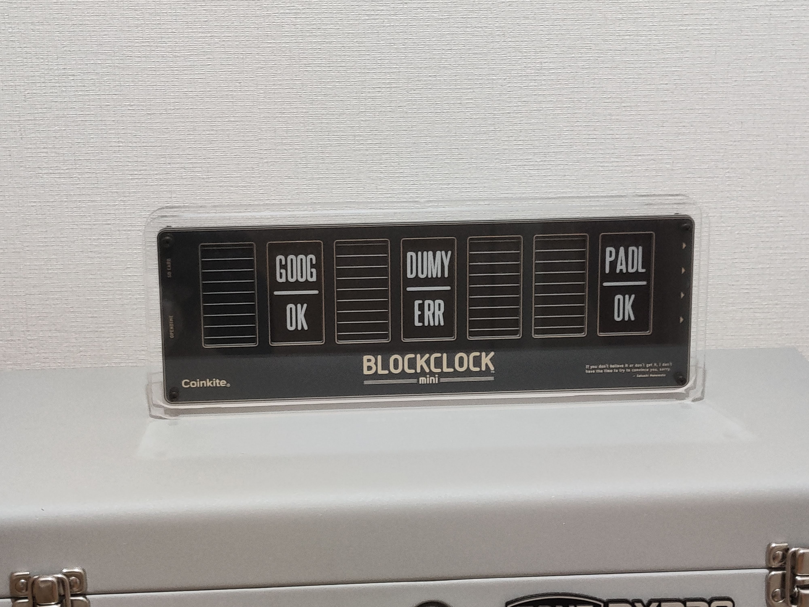

# Lapp Dashbaord

## Introduction


Lapp Dashboard is a simple server that monitors any web endpoints (specifically, any website / API and lightning network nodes), and allows users to view their current status from the browser or, optionally, over Discord or on their BlockClock Mini.

## How to use
First, download & prepare the express app:
```
git clone https://github.com/katokishin/lapp-dashboard
npm install
```
Next, you must create a `.env` file and fill it out as explained in the `.env.example` file:
```
cp .env.example .env
nano .env  # or any other text editor
```
```
USE_DISCORD=false
USE_BCMINI=true
BCMINI_LOCAL_IP=192.168.11.2
```
Add services to a new file `listServices.json` under the folder `monitoring`:
```
[
  { "position":0, "name":"GHUB", "type":"WEB", "url": "https://github.com" },
  ...
]
```
Make sure not to forget to add the "macaroon" property for LND nodes, (Give it a readonly.macaroon for safety!)
and make sure the node is actually listening for REST connections. (`rpclisten` parameter.)

If you run your node in a Docker container or on the cloud, check whether the RPC port is exposed as well.

Finally you can run the program:
```
npm start
```

## Tor support
If you have Tor installed on your system, you can also monitor services & nodes over Tor.

Example `listService.json` and `.env` for monitoring LND over Tor: 
```
[
  {
    "position": 0,
    "name": "LND1",
    "type": "LND",
    "url": "https://someonionaddress.onion:8080",
    "macaroon": "somehexademicalmacaroon123..."
  },
  ...
]
```
This also should not require manual settings in `.env` as long as defaults are used for Tor & LND REST API.

## Getting a readonly.macaroon from Lnd
From the `.lnd` directory, perform `xxd -ps data/chain/bitcoin/mainnet/readonly.macaroon` to get it in hexadecimal format.

Remove newlines and add to `listService.json` where necessary.